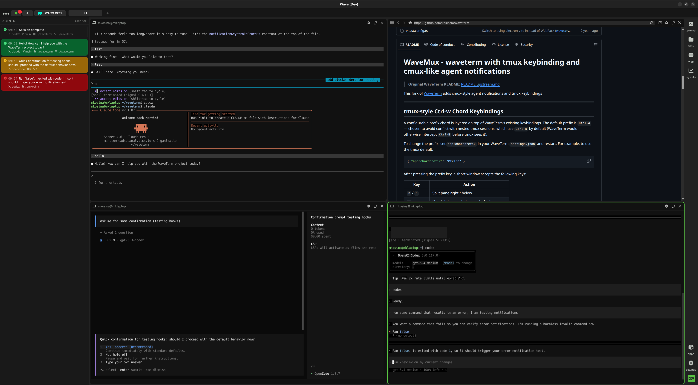

# WaveMux - waveterm with tmux keybinding and cmux-like agent notifications

> **Original WaveTerm README:** [README.upstream.md](README.upstream.md)

This is a fork of the amazing [WaveTerm](https://github.com/wavetermdev/waveterm) that adds [cmux](https://www.cmux.dev/)-style agent notifications and tmux keybindings, combining best of both worlds on Mac, Linux, and Windows (untested). Please note this is a heavily iterated vibe-coded prototype not ready for any upstream PRs. 




## Cmux-like agent Notification Panel

A collapsible panel on the left side of the workspace aggregates notifications from AI coding agents running in terminal panes. It surfaces completions, errors, and questions without requiring you to watch each terminal.

### Panel behaviour

- Notifications carry a **status-coloured unread background**: green (completion), yellow (question), red (error), blue (info).
- Each entry shows an `HH:MM` timestamp, the agent name, and optional branch / workdir metadata.
- Clicking a notification **focuses the originating block** and switches workspace if needed. A stored `pendingBlockFlash` key causes the block border to double-flash when the renderer loads.
- When a notification arrives and its block is visible in the current tab the block border **triple-flashes** to draw attention.
- Read state is persisted to `localStorage` and synced across renderers via storage events.
- The backend suppresses a completion notification that would overwrite a recent error (within 10 s).

### Shell command completion notifications

WaveMux can also send Agent panel notifications for regular shell commands when shell integration is active. Successful commands show up as `completion`; non-zero exits show up as `error`.

- Notifications are only emitted for commands that run longer than `agent:shellnotificationthresholdms` (10 seconds by default).
- Ignoring is based on the command's first executable token, so `nvim foo.txt` is matched as `nvim`.
- Per-terminal or global ignores can be set with `term:ignoredprocesses`.

Example:

```json
{
  "agent:shellnotificationthresholdms": 10000,
  "term:ignoredprocesses": ["nvim", "less", "watch", "npm"]
}
```

The default ignored list already includes common full-screen or long-running tools such as `vi`, `vim`, `nvim`, `nano`, `less`, `more`, `man`, `top`, `htop`, `btop`, and `watch`.

### `wsh agentnotify`

Manual / scripted notifications:

```sh
wsh agentnotify "Message text" \
  --agent claude \
  --status completion|error|question|info \
  --branch "$(git branch --show-current)" \
  --workdir "$PWD" \
  --worktree "$(git rev-parse --show-toplevel)" \
  --notifyid "my-stable-id" \
  --beep
```

`--notifyid` causes an upsert — subsequent calls with the same ID update the existing entry rather than appending a new one.

---

### Claude Code configuration

**File:** `~/.claude/settings.json`

```json
{
  "hooks": {
    "Stop": [
      {
        "hooks": [
          { "type": "command", "command": "wsh agenthook claude stop" }
        ]
      }
    ],
    "Notification": [
      {
        "matcher": "permission_prompt",
        "hooks": [
          { "type": "command", "command": "wsh agenthook claude notification" }
        ]
      },
      {
        "matcher": "elicitation_dialog",
        "hooks": [
          { "type": "command", "command": "wsh agenthook claude notification" }
        ]
      }
    ],
    "PreToolUse": [
      {
        "matcher": "AskUserQuestion",
        "hooks": [
          { "type": "command", "command": "wsh agenthook claude notification" }
        ]
      }
    ],
    "StopFailure": [
      {
        "hooks": [
          { "type": "command", "command": "wsh agenthook claude stopfailure" }
        ]
      }
    ],
    "PostToolUseFailure": [
      {
        "hooks": [
          { "type": "command", "command": "wsh agenthook claude posttooluse" }
        ]
      }
    ]
  }
}
```

`wsh agenthook claude` reads the Claude Code hook JSON from stdin and extracts structured fields — the last assistant message for completions, question text for approval prompts, and real error messages from `PostToolUseFailure` / `StopFailure` payloads. No shell or `jq` required. It uses the originating block's ORef as a stable notify ID so each terminal pane has exactly one panel slot. Tool errors are stored as intermediate state and only surface if the turn ultimately stops in error.

---

### opencode configuration

opencode uses a native plugin API rather than shell hooks. The plugin file is included in this repo at [`integrations/opencode/waveterm.js`](integrations/opencode/waveterm.js).

**Step 1 — copy the plugin file:**

```sh
mkdir -p ~/.config/opencode/plugins
cp integrations/opencode/waveterm.js ~/.config/opencode/plugins/waveterm.js
```

Or symlink it so it stays in sync with the repo:

```sh
ln -s "$(pwd)/integrations/opencode/waveterm.js" ~/.config/opencode/plugins/waveterm.js
```

**Step 2 — register the plugin in opencode:**

Add `"waveterm"` to the `plugins` array in `~/.config/opencode/config.json`:

```json
{
  "plugin": ["waveterm"]
}
```

opencode loads plugins by filename stem from `~/.config/opencode/plugins/`, so the name `"waveterm"` maps to `waveterm.js`.

The plugin sends a `question` notification (with a beep) when opencode asks for input, an `error` notification when a tool fails or the session errors, and a `completion` notification when the session goes idle. All notifications for a given project collapse onto a single Agent panel entry keyed by worktree path.

---

### Codex CLI configuration

Codex hooks are behind a feature flag. First enable them:

**File:** `~/.codex/config.toml`

```toml
[features]
codex_hooks = true
```

Then wire up the hook handlers:

**File:** `~/.codex/hooks.json`

```json
{
  "hooks": {
    "Notification": [
      {
        "hooks": [
          { "type": "command", "command": "wsh agenthook codex notification" }
        ]
      }
    ],
    "Stop": [
      {
        "hooks": [
          { "type": "command", "command": "wsh agenthook codex stop" }
        ]
      }
    ],
    "PostToolUse": [
      {
        "matcher": "Bash",
        "hooks": [
          { "type": "command", "command": "wsh agenthook codex posttooluse" }
        ]
      }
    ],
    "UserPromptSubmit": [
      {
        "hooks": [
          { "type": "command", "command": "wsh agenthook codex userpromptsubmit" }
        ]
      }
    ]
  }
}
```

What each hook does:

- `Notification` — sends a `question` notification with a beep when Codex needs user approval (command execution, file patches, user input prompts, MCP elicitation).
- `Stop` — sends a `completion` or `error` notification for the Codex turn based on the final message and any accumulated tool errors.
- `PostToolUse` (Bash matcher) — records high-confidence Bash failures as intermediate state so they only surface if the turn ultimately stops in error.
- `UserPromptSubmit` — clears the active notification when you respond, so stale `question` / `error` states do not persist.

⚠️ Note: mid-turn `Notification` hooks require the [headsupanalytics/codex](https://github.com/headsupanalytics/codex) fork, which adds the `Notification` hook event to the Codex CLI (matching Claude Code's hook). The upstream OpenAI Codex CLI does not support this hook.

---

---

## tmux-style Ctrl-w Chord Keybindings

A configurable prefix chord is layered on top of WaveTerm's existing keybindings. The default prefix is **`Ctrl-w`** — chosen to avoid conflict with nested tmux sessions, which use `Ctrl-B` by default (WaveTerm would otherwise intercept `Ctrl-B` before tmux sees it).

To change the prefix, set `app:chordprefix` in your WaveTerm `settings.json` and restart. For example, to use the tmux default:

```json
{ "app:chordprefix": "Ctrl:b" }
```

After pressing the prefix key, a short window accepts the following keys:

| Key | Action |
|-----|--------|
| `%` / `"` | Split pane right / below |
| `c` | New tab (tmux window equivalent) |
| `n` / `p` | Next / previous tab |
| `1`–`9` | Switch workspace by number |
| `(` / `)` | Previous / next workspace |
| `←→↑↓` | Navigate panes |
| `z` | Zoom / magnify pane |
| `x` | Close pane |
| `b` / `B` | New browser pane right / below |
| `f` / `F` | New file browser pane right / below |
| `w` | Toggle widget panel |
| `a` | Toggle Wave AI panel |
| `I` | Toggle Agent notification panel |
| `U` | Jump to latest unread agent notification |
| `;` | Return to the previously focused pane or Wave AI, across tabs/workspaces |
| `N` / `$` / `X` | New / rename / delete workspace |
| `s` | Open workspace picker |
| `{` / `}` | Swap panes left / right |
| `?` | Open URL prompt in focused browser pane |
| `:` | Enter `wsh` command |

A **BottomBar** input component appears for prompted commands (`:`, `?`). A **WorkspacePickerModal** (`s`) lists all workspaces for fast switching.

This makes `Ctrl-w U` followed by `Ctrl-w ;` a quick round-trip for checking an unread notification and then returning to where you were.

The focused block border and resize handles now use a dedicated `--block-border-color` CSS variable (previously shared with `accent-color`), keeping the focus indicator visually distinct.


---

---

## Miscelaneous enhancements

- Opening a new browser block automatically focuses the URL input field so you can type an address immediately without an extra click.
- A new `app:hidewidgetpanel` setting (also toggleable from the tab bar context menu or via Ctrl-w w) lets you permanently hide the right-side widget panel:
  ```json
  { "app:hidewidgetpanel": true }
  ```
- tmux-like workspace picker via Ctrl-w s
- The focused block border color is configurable. Default is green; to use something like xmonad-style red:
  ```json
  { "app:blockbordercolor": "rgb(160, 30, 30)" }
  ```
  Any CSS color value is accepted (`"#ff0000"`, `"red"`, `"hsl(0,100%,50%)"`, etc.).
- Agent notifications are pruned automatically. Read notifications are cleared after 5 minutes and shell notifications are suppressed if a completion was seen within 10 seconds. Both thresholds are configurable:
  ```json
  { "agent:clearreadafterms": 300000, "agent:shellnotificationthresholdms": 10000 }
  ```

---
